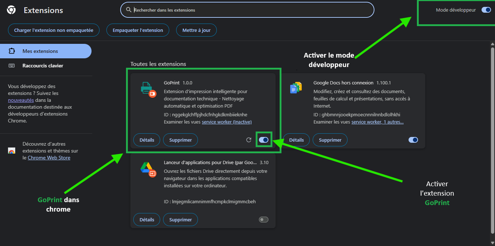
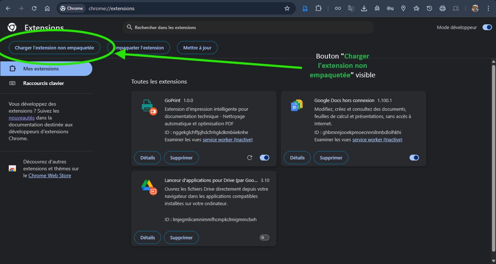
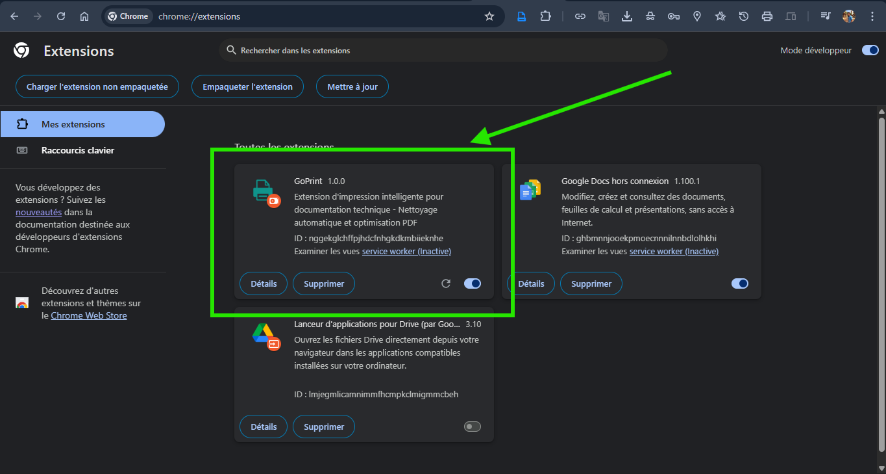
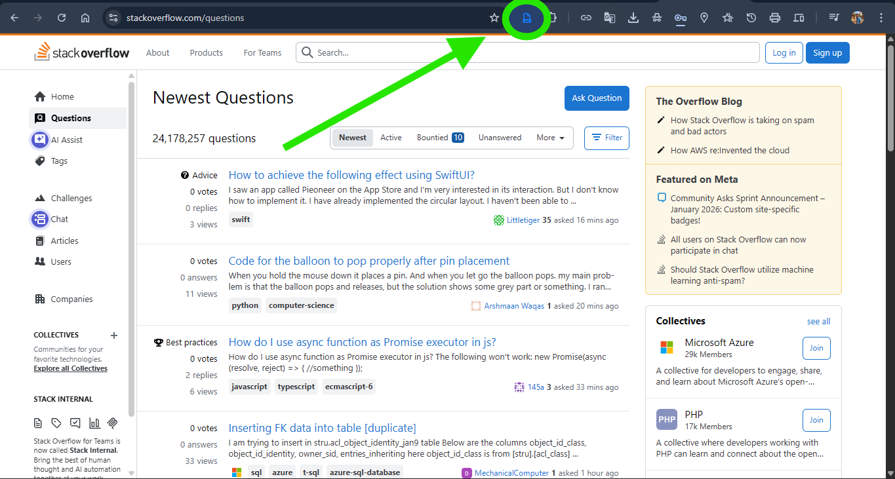
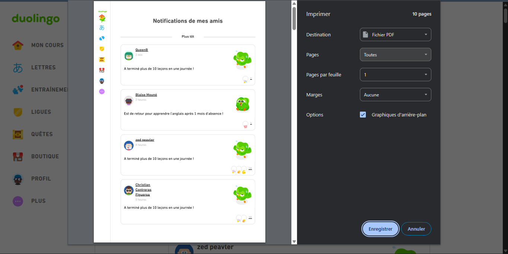
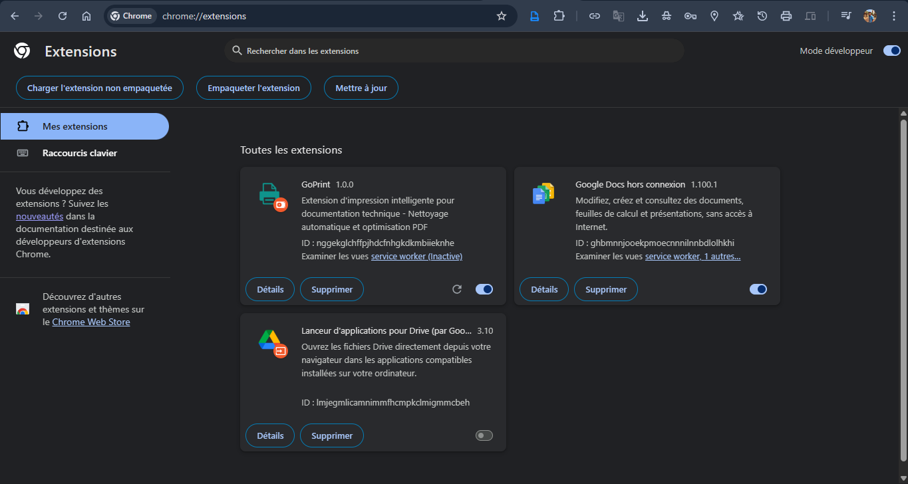
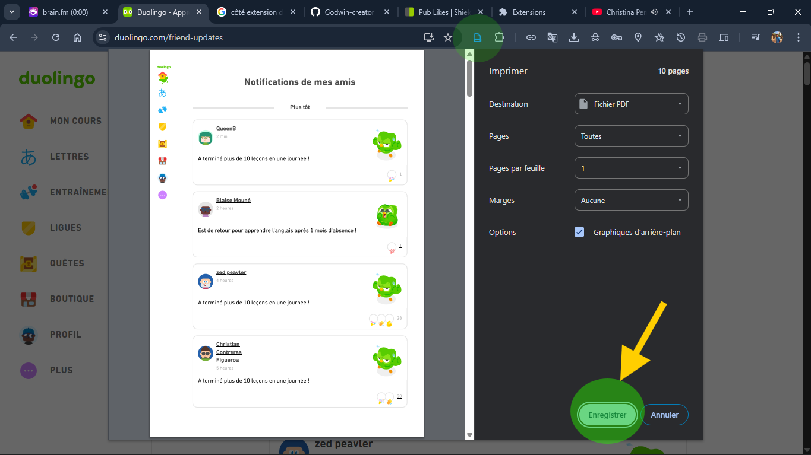

<div align="center">


### Assets — GoPrint

</div>
---

### Structure

```
assets/
├── logo.png                 # Logo de l'extension (220×220 minimum)
├── icon-*.png               # Icônes (16×16, 32×32, 48×48, 128×128)
└── screenshots/             # Captures d'écran du guide d'installation
    ├── 01-extensions-page.png
    ├── 02-developer-mode.png
    ├── 03-load-extension-button.png
    ├── 04-extension-loaded.png
    ├── 05-goprint-icon.png
    ├── 06-print-preview.png
    ├── 07-folder-selection.png
    ├── 08-extension-menu.png
    ├── 09-first-click.png
    └── 10-settings-result.png
```


**Aperçu**  


#### Icônes
- **Fichiers** : `icon-16.png`, `icon-32.png`, `icon-48.png`, `icon-128.png`  
- **Tailles** : 16×16, 32×32, 48×48, 128×128 px  
- **Format** : PNG transparent  
- **Usage** : barre d’outils, liste d’extensions, store

**Référence manifest.json**
```json
"icons": {
  "16": "icons/icon-16.png",
  "32": "icons/icon-32.png",
  "48": "icons/icon-48.png",
  "128": "icons/icon-128.png"
}
```

---

### Screenshots

**Dossier** : `assets/screenshots/`  
**Format recommandé** : PNG ou WebP  
**Résolution recommandée** : 1920×1080 px (min. 1280×720 px)  
**Poids cible** : < 500 KB par image

#### Galerie (aperçu dans GitHub)
Utilisez ces balises Markdown ou HTML pour que les images s’affichent dans l’aperçu GitHub. Ajustez la largeur selon le rendu souhaité.


<!-- Galerie de screenshots (exemple 3 par ligne) -->
  

  

  


```

#### Liste des screenshots
| # | Nom | Description |
|---:|---|---|
| 01 | `extensions-page.png` | Page chrome://extensions/ |
| 02 | `developer-mode.png` | Mode développeur activé |
| 03 | `load-extension-button.png` | Bouton Charger l'extension |
| 04 | `extension-loaded.png` | Extension dans la liste |
| 05 | `goprint-icon.png` | Icône dans la barre d’outils |
| 06 | `print-preview.png` | Aperçu d’impression nettoyé |
| 07 | `folder-selection.png` | Dialogue de sélection dossier |
| 08 | `extension-menu.png` | Menu des extensions |
| 09 | `first-click.png` | Console après premier clic |
| 10 | `settings-result.png` | Résultat final nettoyage |

---

**Statut** : Prêt pour ajout des assets  
**Version** : 1.0.0  
**Auteur** : Komi Godwin EDOH BEDI  
**Date** : 18 janvier 2026

---
